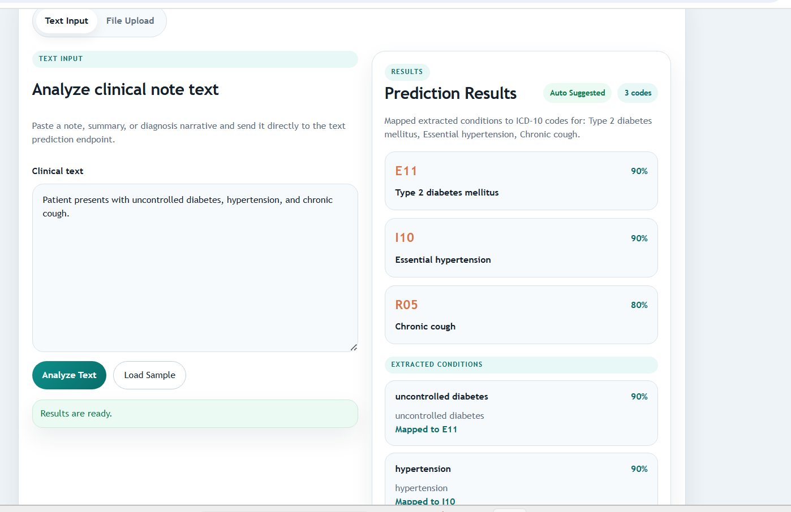
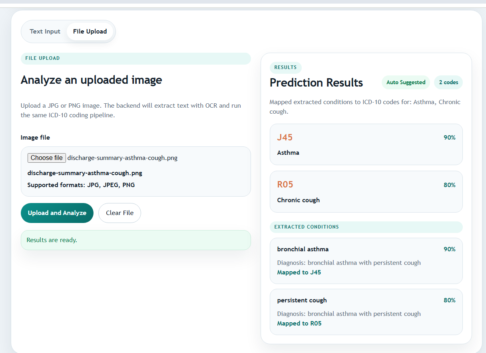

# AI Medical Coding Assistant

An AI-powered system that converts clinical text into standardized medical codes such as ICD-10, improving accuracy and reducing manual effort in healthcare coding workflows.

This project can be developed as a full-stack application:

- A backend API for NLP, code prediction, OCR processing, and integrations
- A frontend interface for entering clinical text, uploading files, reviewing predictions, and supporting human-in-the-loop corrections

---

# Project Overview

This project automates the process of mapping clinical notes and uploaded medical images to diagnosis codes using NLP, OCR, and LLMs.

The application supports two input methods in the same workspace:

- Submit clinical notes manually
- Upload scanned images or screenshots
- View predicted ICD-10 codes with confidence scores
- Review explanations before finalizing results

---

# Objectives

- Extract medical entities such as diseases and conditions from clinical text
- Map extracted entities to ICD-10 codes
- Provide confidence scores and explanations
- Enable human-in-the-loop review and corrections
- Build a frontend experience for coders, analysts, or clinicians to interact with the system

---

# Tech Stack

## Backend

- Python
- FastAPI

## Frontend

- React
- TypeScript
- Vite
- Custom CSS dashboard UI

## AI / NLP

- LangChain
- OpenAI for extraction and mapping

## Data Processing

- Pandas
- Custom ICD-10 mapping dataset

## OCR / File Processing

- EasyOCR
- Pillow
- NumPy

---

# Project Structure

```text
ai-medical-coding/
|
|-- backend/
|   |-- app/
|   |   |-- main.py
|   |   |-- routes/
|   |   |-- services/
|   |   |-- models/
|   |   `-- utils/
|   |
|   |-- ai/
|   |   |-- prompts/
|   |   |-- chains/
|   |   `-- mapping/
|   |
|   |-- data/
|   |   `-- icd_codes.csv
|   |
|   `-- requirements.txt
|
|-- frontend/
|   |-- src/
|   |   |-- components/
|   |   |-- lib/
|   |   |-- App.tsx
|   |   `-- styles.css
|   |-- .env.example
|   `-- package.json
|
|-- tests/
`-- README.md
```

# Application Workflows

## Text Input Workflow

```text
Clinical Text Input
        |
Text Preprocessing
        |
LangChain Pipeline
        |
OpenAI LLM
        |
Entity Extraction
        |
ICD Code Mapping
        |
Response (Codes + Confidence + Explanation)
```

## Text Input Example

```text
Patient presents with uncontrolled diabetes and hypertension.
```

## Example Output

```json
{
  "codes": [
    {
      "code": "E11",
      "description": "Type 2 diabetes mellitus",
      "confidence": 0.92
    },
    {
      "code": "I10",
      "description": "Essential hypertension",
      "confidence": 0.88
    }
  ],
  "explanation": "Identified keywords 'diabetes' and 'hypertension' from clinical text."
}
```


## Frontend Text Review Flow

The text workflow in the frontend is designed for copied notes, summaries, or typed diagnoses.

Flow:

1. Open the `Text Input` tab.
2. Paste clinical text into the textarea.
3. Click `Analyze Text`.
4. Review the result panel on the right side.

The result panel currently shows:

- mapped ICD-10 code cards
- confidence percentages
- an `Auto Suggested` or `Needs Review` badge
- extracted-condition evidence cards
- unmatched conditions when manual follow-up is required

Example text used in the UI:

```text
Patient presents with uncontrolled diabetes, hypertension, and chronic cough.
```

Expected review outcome from that example:

- `E11` for Type 2 diabetes mellitus
- `I10` for Essential hypertension
- `R05` for Chronic cough
- extracted-condition traceability for each matched term

## Backend Components

### 1. Prompt Engineering

- Extract diseases from text
- Map diseases to ICD codes
- Generate structured JSON output

### 2. LangChain Pipeline

- Input -> Prompt Template -> LLM -> Output Parser

### 3. Mapping Layer

- ICD-10 dataset lookup
- Hybrid approach using LLM plus rule-based mapping

---

# Running The Project

## Backend

### 1. Install dependencies

```bash
pip install -r backend/requirements.txt
```

### 2. Set environment variables

```env
OPENAI_API_KEY=your_api_key
```

You can copy `backend/.env.example` to `backend/.env` and fill in your API key.

### 3. Run the API server

```bash
uvicorn app.main:app --reload --app-dir backend
```

### 4. Backend API endpoints

```text
POST /predict
POST /predict-from-file
```

### Text request body

```json
{
  "text": "Patient has asthma and chronic cough"
}
```

### File upload request

- Multipart form upload with a `file` field
- Supported image types: `jpg`, `jpeg`, `png`

### Run tests

```bash
pytest
```

## Frontend

The frontend is implemented in `frontend/`.

### 1. Install dependencies

```bash
cd frontend
npm install
```

### 2. Configure frontend API URL

```bash
copy .env.example .env
```

Default value:

```env
VITE_API_BASE_URL=http://127.0.0.1:8000
```

### 3. Run the frontend

```bash
npm run dev
```

The frontend currently supports:

- A tabbed interface with `Text Input` and `File Upload`
- Text submissions against `POST /predict`
- Image uploads against `POST /predict-from-file`
- Shared result rendering for codes, explanations, and reviewer metadata

## File Upload Workflow

```text
Image Upload
        |
File Validation
        |
EasyOCR
        |
Extracted Text
        |
Text Prediction Pipeline
        |
ICD Code Output
```



## Frontend File Upload Review Flow

The file workflow is intended for screenshots, scanned notes, and image-based medical documents.

Flow:

1. Open the `File Upload` tab.
2. Choose a supported image file: `JPG`, `JPEG`, or `PNG`.
3. Click `Upload and Analyze`.
4. Let the backend extract OCR text and run the same prediction service used by the text flow.
5. Review the coding results and extracted-condition details in the shared results panel.

What the file result view highlights:

- mapped ICD-10 code cards for recognized diagnoses
- the review-status badge
- extracted conditions with evidence text
- the mapped ICD code for each extracted condition when available

Example file workflow outcome shown in the UI:

- uploaded image: discharge-summary-style asthma/cough note
- mapped result: `J45` for Asthma
- mapped result: `R05` for Chronic cough
- extracted review items such as `bronchial asthma` and `persistent cough`

## Unified Reviewer Experience

Both input modes feed into the same backend response contract, so the frontend presents a consistent review experience:

- same results panel layout
- same ICD code cards
- same explanation area
- same extracted-condition traceability
- same manual-review signaling

This makes it easier for a coder or reviewer to switch between direct note entry and uploaded-image analysis without learning two different result views.

# Evaluation Metrics

- Precision and recall for code prediction
- Accuracy of entity extraction
- Human validation feedback
- Frontend usability for review workflows

---

# Security Considerations

- API key protection
- Avoid storing sensitive patient data
- Mask personally identifiable information in logs
- Validate uploaded files before OCR processing

---

# Future Enhancements

- Fine-tuned medical NLP models
- Multi-language support
- Real-time coding suggestions
- Integration with EHR systems
- Authentication and user roles in the frontend
- Case history and audit trail

---

# Author

Harshil Savaliya
